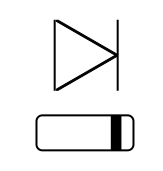
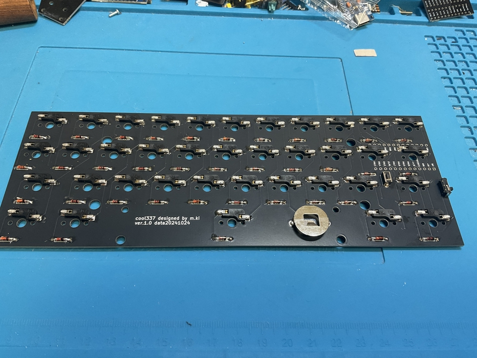
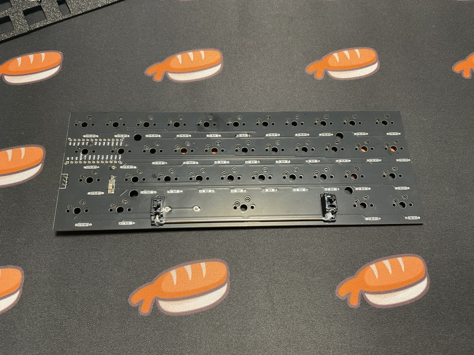
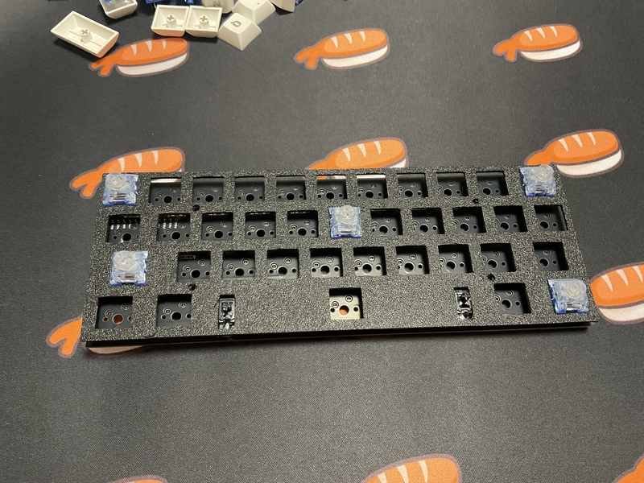
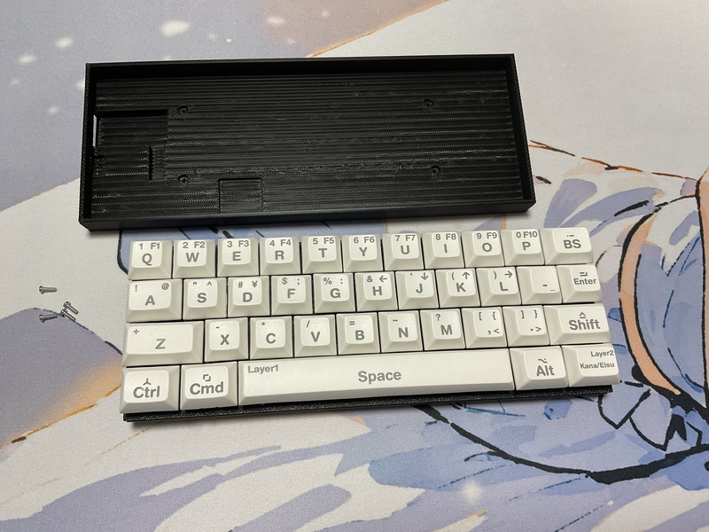
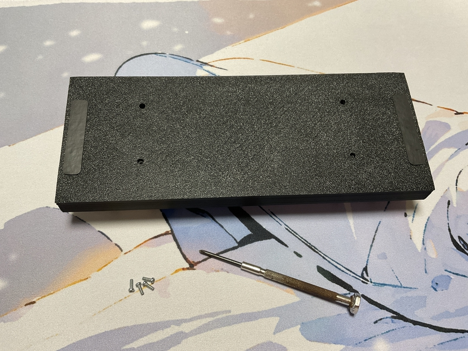
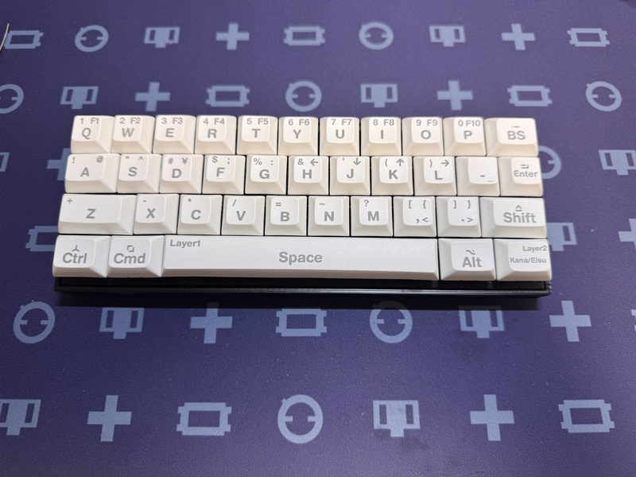

# Build guide

The side with the switch socket silk is the back side of the PCB.

## Build 1

### 1 Diode soldering

Solder the diodes to the back of PCB.
 
PCBの裏面にダイオードのハンダ付けをします。
 
There are lead type and SMD diodes.
 
ダイオードはリードタイプか、SMDがあります。
 
Here, we will explain the lead type soldering.
 
ここでは、リードタイプのハンダ付けの説明をします。
 

Use a lead bender to bend the legs of the diode.
 
リードベンダーを使い、ダイオードの足を曲げます。
 
Insert the diode into the board.
 
ダイオードを基板に挿しこみます。
 

Please pay attention to the orientation of the diode.
 
ダイオードの向きに注意してください。
 

Please solder.
 
はんだ付けをしてください。
 
 
Then, cut off the excess lead with nippers.
 
その後、余ったリードをニッパーで切り取ってください。

[リードタイプDiodeはんだ付け動画](https://youtu.be/lbAQkKzNawM)

[SMD Diodeはんだ付け動画](https://youtu.be/ODk16bd4XkA)
 
 

### 2 Switch socket soldering

Solder the switch sockets on the back side.
 
裏面にスイッチソケットのハンダ付けをします。
 

[Switch socketハンダ付け動画](https://youtu.be/ZnbgaueMR4w)

### 3 Reset switch soldering

Insert the reset switch from the back of the PCB and solder the exposed part.
 
リセットスイッチをPCBの裏面から差し込んで、表面に出た部分をはんだ付けしてください。
 

[リセットスイッチのはんだ付けの作業動画](https://youtu.be/Pl24Exfh8b8)

### 4 Battery parts soldering(Bluetooth option)

Solder the slide switch first.
 
最初にスライドスッチをはんだ付けします。
 

Insert the switch from the back of the PCB with the switch knob facing outward.
 
スイッチのつまみが外側に向くようにして、PCBの裏面から差し込みます。

After temporarily fixing it with masking tape, etc., solder the exposed part of the PCB.
 
マスキングテープなどで仮固定をしてから、PCBの表面に出た部分をはんだ付けします。
 

[スライドスイッチのはんだ付けの作業動画](https://youtu.be/5nkRklibay4)

 

Next, solder the capacitor.
 
次に、コンデンサをはんだ付けします。
 
 
First, apply solder to only one side of the two pads.
 
最初に、２つあるパッドの片側だけに、はんだを盛り付けます。

Place the capacitor and fix it by melting the solder.
 
コンデンサを置き、もったはんだを溶かしながら、固定します。
 
Solder the capacitor, applying solder to the remaining pads.
 
残りのパッドにはんだを盛りながら、コンデンサをはんだ付けします。
Finally, attach the battery holder.
 

[コンデンサのはんだ付け作業の動画](https://youtu.be/8CFiDMtg21s)

 

最後に、電池ホルダを取り付けます。
 
Insert it from the back side of the PCB and solder the front side. Using masking tape for temporary fixation will make the work easier.
 
PCBの裏面から差し込んで、表面をはんだ付けします。仮固定にマスキングテープを使うと作業が簡単になります。
 

[電池ホルダのはんだ付けの作業動画](https://youtu.be/ltA8kcLqso4)

### 5a BLE MIcro Pro
Please prepare two con-through (12 pin 3.5mm) instead of the pin header included with BLE Micro Pro.
 
BLE Micro Pro付属のピンヘッダではなく、コンスルー（12ピン 3.5mm）を２つ用意してください。

There is a small hole in the side of the conthru. Insert it into the PCB, being careful to orient the holes the same way.
 
コンスルーの側面に小さい穴が開いています。穴を同じ向きになるよう注意して、PCBに差し込んでください。

Insert it into the con-through so that the part with the  BLE Micro Pro parts is visible. If the  BLE Micro Pro easily comes off from the console, we recommend soldering. However, due to the structure of the bottom plate of the 3D printer, I think it will be difficult to remove, so no soldering is necessary.
 
 BLE Micro Proの部品が載っている方が見えるように、コンスルーに差し込んでください。もし、 BLE Micro Proがコンスルーから外れやすいときははんだ付けをお勧めします。ただし、3Dプリンタのボトムプレートの構造上、外れにくいと思うので、はんだ付け不要です。
 
When using a 12-pin con-through, insert it into the 12 holes counting from the USB side of the BLE Micro Pro.
 
コンスルー12ピンを使用するとき、BLE Micro ProのUSB側から数えて12箇所分の穴に差し込んでください。
 

### 5b Pro Micro
If you are not interested in wireless connectivity, you can keep the price low by using the pro micro.
 
もしあなたが無線接続に興味がないのであれば、pro microを使用することで価格を低くすることができます。
  
Please prepare two con-through (12 pin 3.5mm) instead of the pin header included with pro micro.
 
pro micro付属のピンヘッダではなく、コンスルー（12ピン 3.5mm）を２つ用意してください。
 

There is a small hole in the side of the conthru. Insert it into the PCB, being careful to orient the holes the same way.
 
コンスルーの側面に小さい穴が開いています。穴を同じ向きになるよう注意して、PCBに差し込んでください。

Insert it into the con-through so that the part with the pro micro parts is visible. If the pro micro easily comes off from the console, we recommend soldering. However, due to the structure of the bottom plate of the 3D printer, I think it will be difficult to remove, so no soldering is necessary.
 
pro microの部品が載っている方が見えるように、コンスルーに差し込んでください。もし、pro microがコンスルーから外れやすいときははんだ付けをお勧めします。ただし、3Dプリンタのボトムプレートの構造上、外れにくいと思うので、はんだ付け不要です。
 

Some of them are soldered.
一応はんだ付けしたものもです。

### 6a Install firmware （BLE Micro Pro）

Here is an [article](https://sizu.me/m_ki/posts/01s8uea4u7x8) on how to do it.
 
ここにやり方の[記事](https://sizu.me/m_ki/posts/01s8uea4u7x8)があります。
 

### 6bInstall firmware （pro micro）

There is info.json, so please use it to create firmware.
 
info.jsonがありますので、それを使って、ファームウェアを作成してください。
 
 
キーマップ編集サイト
[Vial](https://get.vial.today/)

### 7 Fix the stabilizer

Attach the stabilizer to the surface of the PCB.
 
PCBの表面にスタビライザーを装着してください。
 
The stabilizer will operate smoothly if it is greased.
 
スタビライザーはグリスをしておくと、滑らかに稼働します。
 
 

### 8 Fix the switch plate with screws

Insert the 3D printed switch plate, M2 spacer (6mm), and then secure it with M2 screws (6mm).
 
3Dプリントのスイッチプレート、M2スペーサー（6mm）の順でM2ネジ（6mm）を差し込んで固定します。
  

### 9 Insert the key switch

Insert the key switch from the switch plate side.
 
スイッチプレート側からキースイッチを差し込んでいきます。
 
 

### 10 Fix the bottom case with screws

Secure the bottom plate with four M2 screws (4mm).
 
ボトムプレートをM2ネジ（6mm）４本で固定します。

### 11 Complete

Attach your favorite keycaps and you're done.
 
お気に入りのキーキャップをつけて完成です。
 

I wrote an article about QAZ layout keycaps [here](https://sizu.me/m_ki/posts/4fr24ift68fc).
 
QAZレイアウトのキーキャップについて、[ここ](https://sizu.me/m_ki/posts/4fr24ift68fc)に記事を書きました。
 

 
Welcome to the world of the best keyboards.
 
最高のキーボードの世界にようこそ。
 
